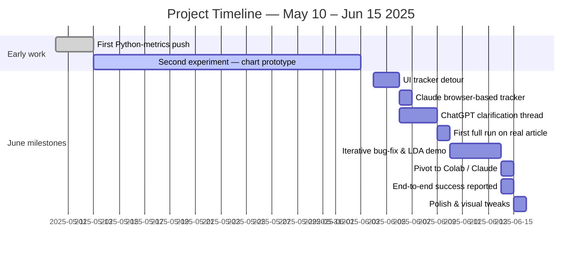

# ai-vs-human

## History


## Limited Timeline Notes (UPDATE)
[https://claude.ai/chat/2c4edba8-f299-4733-a0d1-01bdee92d883](https://claude.ai/chat/2c4edba8-f299-4733-a0d1-01bdee92d883)
[https://chatgpt.com/c/6842fcb6-0294-8012-9a52-07062cfd0346](https://chatgpt.com/c/6842fcb6-0294-8012-9a52-07062cfd0346)
[https://chatgpt.com/c/6847536d-b5a0-8012-8255-6dbb9619873e](https://chatgpt.com/c/6847536d-b5a0-8012-8255-6dbb9619873e)
[https://chatgpt.com/c/68200b23-3744-8012-b3ee-93b73cc94a02](https://chatgpt.com/c/68200b23-3744-8012-b3ee-93b73cc94a02)

I don't even know how many versions of this I have at this point. And when I say versions, I mean attempts.

1. App.py, ah, this the one I abandoned when Codespaces informed me I wwas doing prod environment things. So that's bad.
2. Gemini's Typescript brick that stole several hours of my life.

---

> **NOTE**  Everything that follows inside the grey quote‑boxes is copied **verbatim** from my original rough notes. Only the surrounding headings and file references are new.

### May 10 – May 12 · **First Python‑metrics Push Collapses**

> **5/10** Noise<br>
> I found a thread where, I had apparently had enough. There's a fair bit of sailor in the transcripts I provided the AI.<br> <br>
> This wasn't a test, like the others, this was clearly the result of frustration if not actual anger. It has transcripts of my tribulations, 5 versions of a python script that I'm guessing never worked. And, undoubtedly, it represents several days of work with nothing useful to show for it. I bet it's a good read when it isn't getting late and I have to think about how I'm prone to think in my sleep...<br> <br>
> Obs, didn't give up, however if I don't find anything else in another AI it looks like I put that shit aside for nearly a month. This is the last of what is still in GPT and, oddly, it is fresher than most of what follows, not sure why.

**Related files**
0510-chatgpt-ai-script-debugging-analysis.md · 0510-ai\_script\_reflection\_full\_with\_appendix.md

---

### May 13 – Jun 03 · **Chart‑Prototype & Metric Experiment**

> **5/13** This is a continuation of of a thread I appear to have deleted.<br>
>
> * Part of the history is gone, just an error alter now.<br>
> * I recall the file/data set it's referencing, my guess is there were 2 scripts, one to get me the data, and one to get the visualizations. For a couple of versions I had to split it apart to isolate issues with both the script and the AI trying to run it.<br>
> * Given the inputs I'm providing it early on I have to assume this was being done across two sessions, possibly two AI, and the other was clearly crapping out since these are obiously AI responses.<br>
> * There were a few exchanges up to a point where it started having issues and I can only imagine I walked away.<br>
> * I was able to feed it data from earlier on and it managed to produce freesh results. No telling if they're any good.<br>
> * I had it provide an overview of the entire conversation:<br>
>   Below is a concise, step-by-step timeline of our conversation and the work we’ve done together:<br>
>   **1. Initial JSON Spec for AI Chatbot** … (steps 1‑8 retained in original notes)<br>
>   **9. High‑Fidelity Downloads**  *You asked for high-resolution outputs; I re-generated each figure at 300 dpi, saved PNGs to `/mnt/data`, and provided download links for all four charts.*

**Related file**
0513-chatgpt-human-contribution-metrics-charts.md

---

### Jun 04 – Jun 05 · **UI Tracker Detour**

*(No rough notes captured for this window, but see 0604‑transcript‑1.md for the full chat log.)*

---

### Jun 06 · **Claude 4 Opus Tracker + ChatGPT Clarification**

> **6/6/25** Attempted to use Claude 4 Opus. While the prompt wasn't incredibly sophisticated it wasn't bad either. First, it tried to give me a webpage that served as a tracking app so I could log my F'ing time. I responded:<br>
> “I could manage that with paper, no wonder you went with a web page. I want to give the 4 articles to something (I assumed python) that would measure things like counts, changes, shifts in semantics. Actual transparency.”<br> <br>
> I got python, which I've run in ChatGPT o4‑mini‑high, provided it with the test files, and we've achieved data/visual.<br> <br>
> Needless to say, the output looked nothing like the example Claude stated I could expect.<br> <br>
>
> ````text
> Content retention: 67.3%
> Word count change: +18.5%
> Vocabulary expansion: 1,247 → 1,432 unique words
> Estimated AI contribution: ~32.7% of content transformed
> ```<br>
> <br>
> I'd put the JSON in, but it's about 100 lines of single words.<br>
> <br>
> GPT was sure that I wrote the article draft, and then AI contributed 96% of the final... that's def what happened.<br>
> <br>
> All conversations captured.
> ````

**Related files**
0606-claude-authenticity-.md · 0606-chatgpt-clarification-of-request.md

---

### Jun 09 · **First Full Analyzer Run**

> **UPDATE: 6/9**<br>
> The name of the initial script looks the same, so I assume this is an ongoing attempt to get this one farther than before.<br>
>
> * Can verify by comparing the differetn versions of python<br>
> * This might be the first time measuring semantics came into play. Even if I'm wrong (and it doesn't read like I am) this is.<br>
> * AI made recommendations on my requests to follow the meaning, not the counts.<br>
> * One of the methods it had offered... Ah crap, I remember this now.<br>
>   \-- It employes an OpenAI model for working with language. It couldn't run it and I asked about codespaces and collab. I guess this isn't where I learned about those. I'll have to assume my memory of it being SERP is still accurate.<br>
> * There were conflicts with different packages it tried calling from different locations, it recomemended swithcing the function whih is where it stops. I think I have the original that it stepped back from working in the current version.

**Related file**
ChatGPT-Python File Analysis.md

---

*Last updated: 2025‑06‑30.  Original field notes preserved verbatim; headings added for clarity.*

## File Map for “It’s Not Magic, It’s Negotiation” Series

> *Use this as a lookup index:* each article in the planned series is paired with the project files that best document or illustrate its storyline. File names are preserved exactly; citation bubbles point you straight to the source.

---

    ## Act I · **The Vision & The Fall**

    ### Article 1 — *The Blueprint Before the Bugs*

    * 0510-chatgpt-ai-script-debugging-analysis.md fileciteturn7file1
    * 0510-ai\_script\_reflection\_full\_with\_appendix.md fileciteturn7file7
    * 0513-chatgpt-human-contribution-metrics-charts.md fileciteturn8file2

    ### Article 2 — *The Lure of the “Simple” Fix & the TypeScript Brick*

    * 0604-transcript-1.md fileciteturn5file13
    * 0606-claude-authenticity-.md fileciteturn7file6
    * 0606-chatgpt-clarification-of-request.md fileciteturn8file3

    ---

    ## Act II · **The Gauntlet — Learning the Craft by Proxy**

    ### Article 3 — *A Leap of Faith: Trusting an AI to Build What I Couldn’t*

    * 0510-chatgpt-ai-script-debugging-analysis.md (Python pivot sections) fileciteturn7file1
    * Claude-Python NLP Research in Colab.md fileciteturn7file3
    * ChatGPT-Python File Analysis.md fileciteturn8file13

    ### Article 4 — *When Your Partner Forgets: AI Amnesia & Missing Functions*

    * 0510-chatgpt-ai-script-debugging-analysis.md (missing‑function saga) fileciteturn8file14
    * timeline-ish.md (sections on lost functions) fileciteturn8file10

    ### Article 5 — *The Hidden Craft of AI Wrangling (The Real “AI Tax”)*

    * 0610-chatgpt-ai-writing-analyzer-help.md fileciteturn8file12
    * 0510-chatgpt-ai-script-debugging-analysis.md (hours‑of‑work reflections) fileciteturn7file1

    ---

    ## Act III · **The Breakthrough & The Takeaway**

    ### Article 6 — *The 2:30 A.M. Insight: From Prompting to Orchestration*

    * 0510-chatgpt-ai-script-debugging-analysis.md (2:30 a.m. clarity) fileciteturn7file1
    * timeline-ish.md (related timestamp notes) fileciteturn8file6

    ### Article 7 — *The Result of the Negotiation: A Tool for Ethical Transparency*

    * Claude-Python NLP Research in Colab.md (finished notebook) fileciteturn7file3
    * Claude-Python NLP Research in Colab.md (steps 1‑2 foundation) fileciteturn7file5

    ### Article 8 — *Finding the Diamond in the Rough*

    * Substack Index Best Practices Research\_.md (final philosophical framing) fileciteturn7file0
    * notes.md (personal reflections — if included later)

    ---

    ### How to Use

    1. **Drafting** — when writing each article, open the paired files for direct quotes, diagrams, or code snippets.
    2. **Curation** — if new files emerge, append them under the appropriate article.
    3. **Cross‑linking** — feel free to drop inline links from article text back to these source files for transparency.

    *Last updated 2025‑06‑30 — update as new material lands.*


##