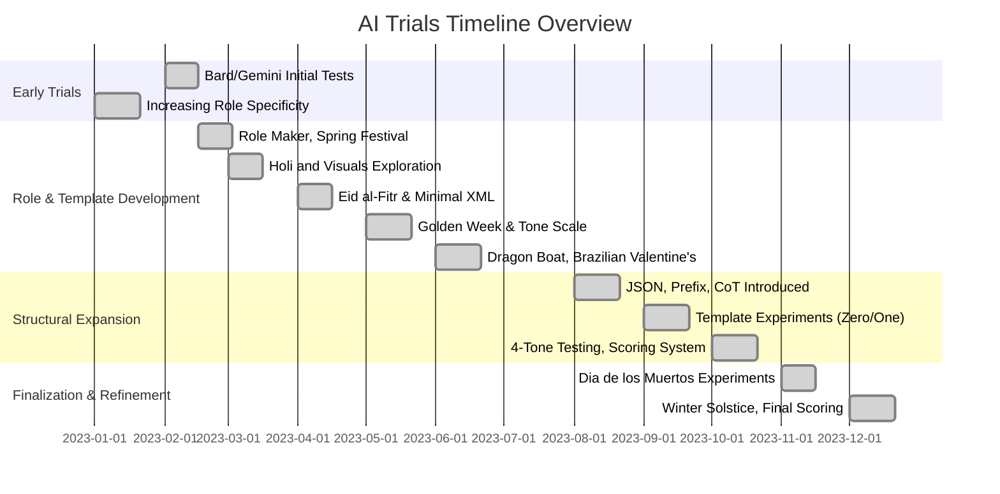

Based on your instructions and the content of the three images, here is the **cleaned-up and correctly ordered** version of the **"Timeline of AI Trials"**, formatted in **Markdown**. All references to "this year/last year" have been removed, and the initial February bullet regarding Bard/Gemini has been moved to the top chronologically.

---

# **Timeline of AI Trials**

---

### **January**

* Project aims to increase specificity of AI roles, focusing on holidays (e.g., MLK Jr. Day for ChatGPT, Makar Sankranti for Bard/Gemini).
* Initial conversations span general to highly specific domain prompts (e.g., general historian → historian focused on MLK Jr.).
* Claude and ChatGPT are used to create initial grading criteria.
* Peer review attempts among the AIs are made but require “Bard intervention.”
* ChatGPT adds detail with increasing prompt specificity.
* Bard/Gemini struggles with templates, needing more guidance.

---

### **February**

* Focus shifts to specialized AI roles (“Role Maker”).
* GPT is created specifically for generating role prompts.
* Experiments test a range of role granularity.
* The Spring Festival (Chinese New Year) is used as a key cultural topic.
* Experiments include a “Basic Role” and “Complex Role” for historians specializing in Chinese history.
* Eight-article series begins, covering Lunar New Year/Spring Festival.
* Spring traditions (renewals, food, deity Nian, fireworks, red decorations) are described.
* A “four-digit prefix system” for article naming is introduced to categorize depth and purpose.

---

### **March**

* Holi is the cultural focus, emphasizing understanding beyond visuals.
* Image-generation AIs are explored for cultural illustration.
* Plans to explore tones in March are postponed.

---

### **April**

* Experiments use Claude 3 Sonnet, ChatGPT-4, and Gemini Pro v1.
* Role is switched from historian to journalist.
* Minimal XML is added to prompts.
* Eid al-Fitr is the main holiday subject.
* AI responses to generalized prompts are compared:

  * Claude: “Globally Acclaimed Historian”
  * ChatGPT: “Global Holiday Historian”
  * Gemini: “Dr. \[Your Name Here], Festival and Folklore Historian”
* Gemini experiments with fictitious identity and Arabic guidance.
* Scoring data is collected via self- and peer-assessments.

---

### **May**

* Focus is on Japan’s Golden Week.
* A simple scale evaluates tone (Respectful, Descriptive, etc.).
* Claude and ChatGPT write with academic, professional, and journalistic tones.
* Articles receive adjusted scoring based on lowest/highest examples.
* Vesak articles vary in tone; scale inconsistencies noted.
* Memorial Day tests tone again with the same article and multiple tones.

---

### **June**

* Role experimentation continues for holidays (e.g., Dragon Boat Festival, Brazilian Valentine’s Day).
* GPT-4 starts assigning test prompts for clarity.
* Tone and writing variability is reviewed across 12 articles.
* Scoring method is refined to address inconsistency.
* Experiments using multiple GPTs for role creation yield weak results.
* Claude outperforms peers in role-based prompts.
* Third-gen roles benefit from XML; fourth-gen are too verbose.
* Claude and GPT-4 create charts for enjoyment.
* Additional testing explores JSON input strategies and article complexity.
* Chain of Thought (CoT) is introduced for structured generation.
* Word counts and naming conventions are standardized.

---

### **August**

* Testing continues with a broader range of roles and prompt types.
* Prompt complexity and structured input (especially XML) emphasized.
* Claude and ChatGPT-4 use “Cultural Observances Analyst” role.
* Holidays: Janmashtami (JK), Flooding of the Nile (FN), Zhongyuan Jie (ZJ).
* Prompt types: Zero Prompt (ZP), Super Prompt (SP), CoT.
* Claude’s editorial oversight shows higher scoring.
* JSON scoring rubric used with Mexico’s Independence Day.
* o1-mini model added for trend analysis.
* Claude’s “incessant apologizing” behavior is reduced.

---

### **September**

* New templates tested (zero-shot, one-shot).
* Emphasis on scoring rubric standardization.
* Multiple languages (JSON, Markdown, TOML, XML, YAML) tested.
* Holidays: Yamashita Surrender Day, Labor Day (US), Vietnam’s Independence Day, Ethiopian New Year, Onam.
* Claude demonstrates strong depth understanding using the prefix system.
* Markup language effectiveness examined.
* o1-mini’s editor capabilities evaluated.
* Merge of templates/rubrics planned.

---

### **October**

* Refined templates created with Claude guidance and 7 clarifying questions.
* GPT-4o and o1-preview tested using new templates.
* Tone switching explored in Halloween articles.
* Four tones tested: professional, personal, neutral, excited.
* Personal tone is variable; excited performs poorly.
* Dia de los Muertos is tested with straightforward prompts.
* Tone tags like “professional” and “appropriate” introduced.
* Scoring data includes model comparisons and complexity levels.
* GPT-4o asks deeper questions (content focus, audience, keywords).
* 100-point scoring system proposed:

  * Historical Accuracy & Detail (30)
  * Structure & Organization (20)
  * Writing Quality (20)
  * Comprehensiveness (20)
  * Unique Value-Add (10)
* Initial subject: “ABS” (Anniversary of Brazil’s Sovereignty).
* Claude’s scores generally trend higher.
* ChatGPT-4o proposes its own scoring with six criteria:

  * Clarity, Depth, Originality, Relevance, Presentation.

---

### **November**

* Trials focus on Dia de los Muertos (Mexico).
* Prompts specify tone (“professional”, “appropriate”) and context.
* Scores vary widely based on complexity and model.
* GPT-4o simulates expert editor role (asks content questions).
* New AI label categories introduced (e.g., “Educational Clarity”).
* National Awareness and SEO signals are considered.
* Future tests aim to assess scaling and volume of content.

---

### **December**

* Models tested: Claude 3.5 Sonnet, ChatGPT-4o.
* Emphasis on finalizing prompt complexity impacts.
* Focus on global winter solstice traditions (China, Egypt, Japan, Russia, Ukraine).
* Claude and ChatGPT-4o analyze and categorize prior results.
* Independent prefix system scoring continues.
* Both AIs identify indicators of cultural depth, purpose, and symbolism.
* Claude highlights patterns of clarity; GPT-4 shows scoring variability.
* Challenges:

  * Claude: tendency to over-score
  * GPT-4: inconsistent rubric alignment
* A final test with harmonized complexity/tone/prompt variation is proposed.